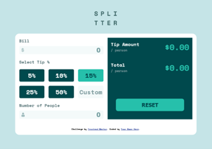
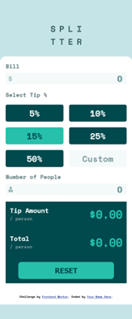

# Frontend Mentor - Tip calculator app solution

This is a solution to the [Tip calculator app challenge on Frontend Mentor](https://www.frontendmentor.io/challenges/tip-calculator-app-ugJNGbJUX). Frontend Mentor challenges help you improve your coding skills by building realistic projects.

## Overview

### The challenge

Users should be able to:

- View the optimal layout for the app depending on their device's screen size
- See hover states for all interactive elements on the page
- Calculate the correct tip and total cost of the bill per person

### Screenshot




### Links

- Solution URL: [https://github.com/toshirokubota/tip-calculator-app](https://github.com/toshirokubota/tip-calculator-app)
- Live Site URL: [https://toshirokubota.github.io/tip-calculator-app/](https://toshirokubota.github.io/tip-calculator-app/)

## My process

### Built with

- Semantic HTML5 markup
- CSS custom properties
- Flexbox
- CSS Grid
- Mobile-first workflow

### What I learned

- I learned the DRY principle and tried to follow the practice on my script.

- This is something I could not figure out. 
I made the tip choice radio buttons so that only one can be selected. I set its display to none so that the default look of radio buttons are hidden. By doing so, I could not use tab to select each radio button, and thus select it via keyboard. So this app can be used only with a pointer device. I am not sure if there is a getting around or using radio buttons is a wrong design choice.

- The form was responding to a RETURN key on input boxes. I had to disable the behavior and I did so through javascript. I saw an article on StackOverflow using the following.
``` 
<form ... onkeydown="return event.key != 'Enter';">
```
This is definitely shorter than my scripting but I did not put an explicit code in html. (I felt it did not look good.) Wonder if one is better than the other.


### Useful resources

- [Prevent users from submitting a form by hitting Enter](https://stackoverflow.com/questions/895171/prevent-users-from-submitting-a-form-by-hitting-enter?page=1&tab=scoredesc#tab-top) - This is a StackOverflow article titled: Prevent users from submitting a form by hitting Enter.

## Author

- Frontend Mentor - [@toshirokubota](https://www.frontendmentor.io/profile/toshirokubota)

## Acknowledgments
